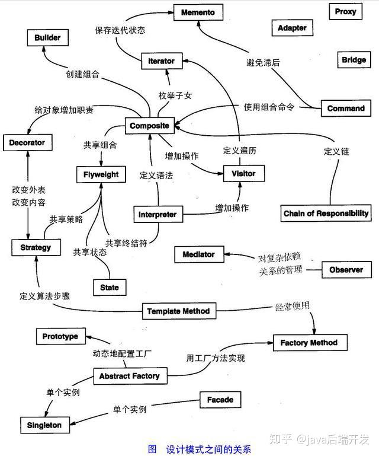
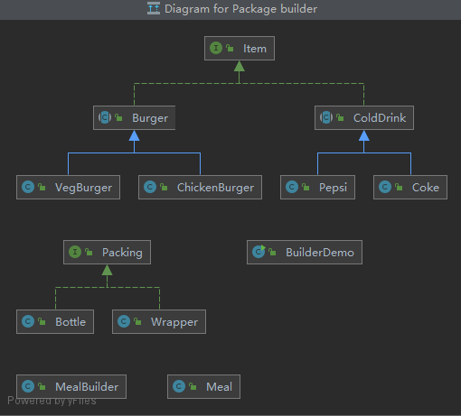

本文主要学习Java23中设计模式

一，主要分为三大类

1.创建型，共五种：工厂模式，抽象工厂模式，单例模式，建造者模式，原型模式
2.结构型，共七种：适配器模式，装饰器模式，代理模式，外观模式，桥接模式，组合模式，享元模式
3.行为型，共十一种：策略模式，模板方法模式，观察者模式，迭代子模式，
责任链模式，命令模式，备忘录模式，状态模式，访问者模式，中介者模式，解释器模式

还可以分为：并发模式和线程池模式，可以用图片来整体图片整体描述：

二设计模式六大原则
1.开闭原则（Open Close Principle)

开闭原则就是说对拓展开放，对修改封闭。在程序进行拓展的时候，不能修改原有代码，
实现一个热插拔的效果。所以一句话概括就是：为了使程序的扩展性好，易于维护和升级。
想要达成这样的效果，需要使用接口和抽象类

2.里氏替换原则（Liskov Substitution Principle)

里氏替换原则是面向对象设计的基本原则之一。里氏替换原则中说，任何基类可以出现的
地方，子类也一定可以出现。LSP是继承复用的基石，只有衍生类可以替换掉基类，软件
单位的功能不受影响，基类才可以被复用，而衍生类也能够在基类上增加新的行为。里氏
替换原则是对开闭原则的补充，实现开闭原则的关键步骤就是抽象化。而基类与子类的继
承关系就是抽象类的具体实现，所以里氏替换原则是对实现抽象化的具体步骤规范。

3.依赖倒置原则（Dependence Inversion Principle)
开闭原则的基础，具体内容：针对接口编程，依赖抽象而不依赖于具体。

4.接口隔离原则（ Interface Segregation Principle)
这个原则的意思是：使用多个隔离接口，比使用单个接口要好。还是一个降低类之间的耦合度的意思，

5.迪米特法则（最少知道原则）（Demeter Principle)
一个实体应当尽量少的与其他实体发生相互作用，使得系统功能模块相对独立。

6.合成复用原则（Composite Reuse Principle)
尽量使用合成/聚合的方式，而不是使用继承

模式详细介绍：

建造者模式

建造者模式（builder Pattern)使用的多个简单的对象一步步构建成一个复杂的对象。这
种类型的设计模式属于创建型模式，它提供了一种创建对象的最佳方式。一个builder类会
一步步构造最终的对象。该builder类是独立于其他对象的。

介绍：
意图：将一个复杂的构建与其表示相分离，使得同样的构建过程可以创建不同的表示。

主要解决：主要解决在软件系统中，有适合面临着“一个复杂对象”的创建工作，其通常由各
个部分的子对象用一定的算法构成；由于需求的变化，这个复杂对象的各个部分经常面临剧
烈的变化，但是将它们组合在一起的算法却相对稳定。

何时使用：一些基本不见不会变，而其组合经常变化的时候。

如何解决：将变与不变分离开。

关键代码：建造者：创建和提供实例，导演：管理建造的实例的依赖关系。

应用实例：1，去肯德基，汉堡、可乐、薯条、炸鸡翅等是不变的，而其组合是经常变化的
所谓套餐，2，Java中的StringBuilder

优点：
分离构建过程和表示，使得构建过程更加零花，可以构建不同的表示。
可以更好地控制构建过程，隐藏具体构建细节
代码复用性搞，可以在不同的构建过程中重复使用相同的构建者

缺点：
如果产品的属性比较少，建造者模式可能会导致代码冗余。
建造者模式增加了系统的类和对象数量。

使用场景：
1.需要生成的对象具有复杂的内部结构。
2.需要生成的对象内部属性相互依赖。

建造者模式在创建复杂对象时非常有用，特别是的那个对象的构建过程设计多个步骤或参数时。
它可以提供更好的灵活性和可维护性，同时使得代码更加清晰可读。

注意事项：
与工厂模式的区别是：建造者模式更加关注与零件装备的顺序。

例子:看src/main/java/builder
